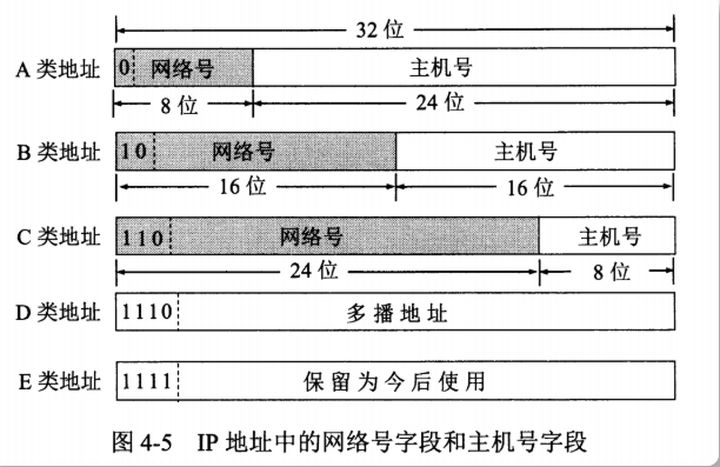
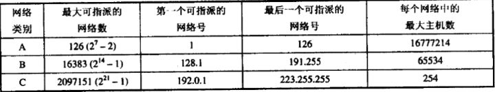
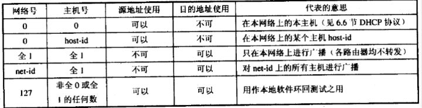
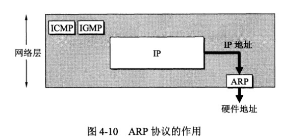
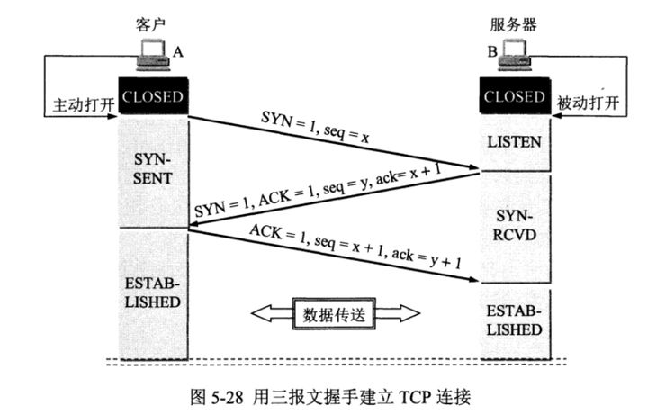
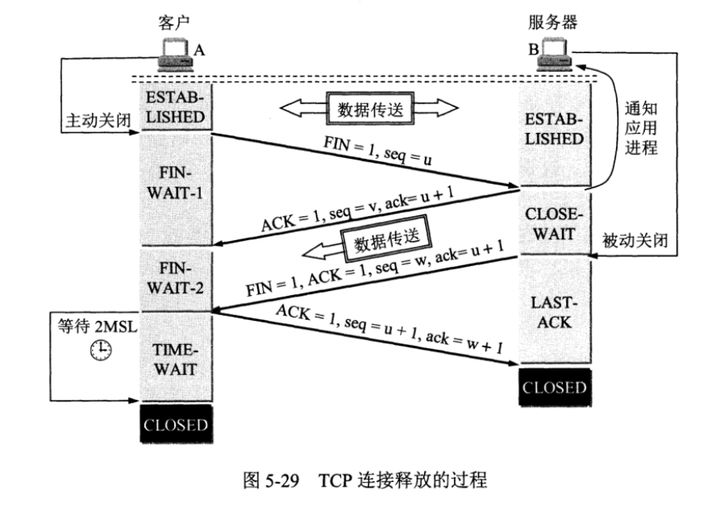
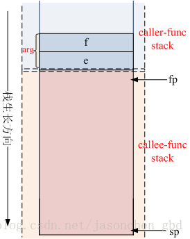
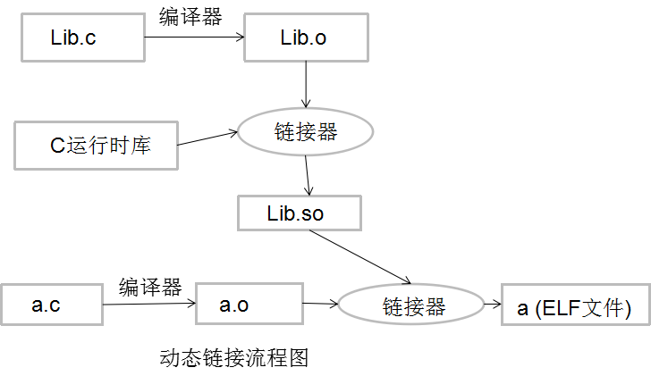

## C++面经
### 语言
- C和C++的区别（封装、继承和多态）
C是面向过程语言，而C++是面向对象。C++有引用、泛型、类
C++在C的基础上增添类，C是一个结构化语言，它的重点在于算法和数据结构。C程序的设计首要考虑的是如何通过一个过程，对输入（或环境条件）进行运算处理得到输出（或实现过程（事务）控制），而对于C++，首要考虑的是如何构造一个对象模型，让这个模型能够契合与之对应的问题域，这样就可以通过获取对象的状态信息得到输出或实现过程（事务）控制。

- 什么是多态
多态性(polymorphism)可以简单地概括为“**一个接口，多种方法**”，它是面向对象编程领域的核心概念。

多态性指相同对象收到不同消息或不同对象收到相同消息时产生不同的实现动作。C++支持两种多态性：编译时多态性，运行时多态性。

编译时多态性（静态多态）：通过**重载函数**实现：先期联编 early binding
运行时多态性（动态多态）：通过**虚函数**实现 ：滞后联编 late binding

参数相同、有virtual关键字：多态重写；
参数相同、无virtual关键字：隐藏；与重写区分。
参数不同、有virtual关键字：隐藏；与重载区分。
参数不同、无virtual关键字：隐藏；与重载区分。

- 什么是虚函数，什么是纯虚函数
定义一个函数为虚函数，不代表函数为不被实现的函数。
**定义他为虚函数是为了允许用基类的指针来调用子类的这个函数。**
定义一个函数为纯虚函数，才代表函数没有被实现。
定义纯虚函数是为了实现一个接口，起到一个规范的作用，规范继承这个类的程序员必须**实现这个函数。**
虚函数实现的过程是：**通过对象内存中的虚函数指针vptr找到虚函数表vtbl，再通过vtbl中的函数指针找到对应虚函数的实现区域并进行调用。**所以虚函数的调用时由指针所指向内存块的具体类型决定的。
**虚函数 vs 纯虚函数，如何选用？**
a. 当基类中的某个成员方法，在大多数情形下都应该由子类提供个性化实现，但基类也可以提供缺省备选方案的时候，该方法应该设计为虚函数。
b. 当基类中的某个成员方法，必须由子类提供个性化实现的时候，应该设计为纯虚函数。

- 纯虚函数作用和实现方式
定义纯虚函数是为了实现一个**接口**，起到一个**规范**的作用，规范继承这个类的程序员必须**实现这个函数。**
应该在什么情况下使用纯虚函数？
　　1、当想在基类中抽象出一个方法，且该基类只做能被继承，而不能被实例化；
　　2、这个方法必须在派生类（derived class）中被实现。
纯虚函数的声明，是在虚函数声明的结尾加 = 0，**没有函数体**。在派生类没有重新定义虚函数之前是**不能调用的**。

- 构造函数和析构函数可以是虚函数吗？
答案是：**构造函数不能是虚函数，析构函数可以是虚函数且推荐最好设置为虚函数。**

首先，我们已经知道虚函数的实现则是通过对象内存中的vptr来实现的。而构造函数是用来实例化一个对象的，通俗来讲就是为对象内存中的值做初始化操作。那么在构造函数完成之前，也即还没有进行初始化，此时vptr是没有值的，也就无法通过vptr找到作为构造函数和虚函数所在的代码区，所以构造函数只能以普通函数的形式存放在类所指定的代码区中。

而对于析构函数，当我们delete(a)的时候，如果析构函数不是虚函数，那么调用的将会是基类base的析构函数。而当**继承的时候，通常派生类会在基类的基础上定义自己的成员，此时我们当然希望可以调用派生类的析构函数对新定义的成员也进行析构。**
同时防止内存泄漏，想去借助父类指针销毁子类对象的时候，不能销毁子类对象。调用基类的析构函数，导致派生类中对象申请的空间得不到释放进而发生内存泄漏。

- static 和const 的作用
其他的不重要，重要的是static 修饰全局变量时**并未改变**其存储位置及生命周期，而是改变了其**作用域**，使**当前文件外的源文件无法访问**该变量。好处如下：
（1）不会被其他文件所访问，修改
（2）其他文件中可以使用相同名字的变量，不会发生冲突。对全局函数也是有隐藏作用。而普通全局变量只要定义了，任何地方都能使用，使用前需要声明所有的.c文件，只能定义一次普通全局变量，但是可以声明多次（外部链接）。注意：全局变量的作用域是全局范围，但是在某个文件中使用时，必须先声明。
用static修饰成员函数，使这个类只存在这一份函数，所有对象共享该函数，不含this指针。
静态数据成员的类型**可以是所属类的类型**，而普通数据成员则不可以。普通数据成员的只能声明为所属类类型的**指针或引用**。（因为是存在静态存储区的，不属于某个对象，不然某个对象中含有某个对象的全部内容就套娃了）
**不可以同时用const和static修饰成员函数。**
C++编译器在实现const的成员函数的时候为了确保该函数不能修改类的实例的状态，会在函数中添加一个隐式的参数**const this***。但当一个成员为static的时候，该函数是没有this指针的。也就是说此时const的用法和static是冲突的。
我们也可以这样理解：两者的语意是矛盾的。static的作用是表示该函数只作用在类型的静态变量上，与类的实例没有关系；而const的作用是确保函数不能修改类的实例的状态，与类型的静态变量没有关系。因此不能同时用它们。

const的作用：
1.限定变量为不可修改。
2.限定成员函数不可以修改任何数据成员。
3.const与指针：
    const char *p 表示 指向的内容不能改变。
    char * const p，就是将P声明为常指针，它的地址不能改变，是固定的，但是它的内容可以改变。

- new 和malloc 的区别
new是**运算符**，malloc()是一个**库函数**；
new会调用**构造函数**，malloc不会；
new返回指定类型指针，malloc返回**void\***指针，需要强制类型转换；
new会自动计算需分配的空间，malloc不行；
new可以被**重载**，malloc不能。

- C++的内存分区
栈区（stack）：主要存放函数参数以及局部变量，由系统自动分配释放。
堆区（heap）：由用户通过 malloc/new 手动申请，手动释放。注意它与数据结构中的堆是两回事，分配方式倒是类似于链表。
全局/静态区：存放全局变量、静态变量；程序结束后由系统释放。
字符串常量区：字符串常量就放在这里，程序结束后由系统释放。
代码区：存放程序的二进制代码。

- vector、map、multimap、unordered_map、unordered_multimap的底层数据结构，以及几种map容器如何选择？
底层数据结构：
vector基于数组，map、multimap基于红黑树，unordered_map、unordered_multimap基于哈希表。
根据应用场景进行选择：
map/unordered_map 不允许重复元素
multimap/unordered_multimap 允许重复元素
map/multimap 底层基于红黑树，元素自动有序，且插入、删除效率高
unordered_map/unordered_multimap 底层基于哈希表，故元素无序，查找效率高。

- const与#define的区别
1.编译器处理方式 
define – 在预处理阶段进行替换 
const – 在编译时确定其值

2.类型检查 
define – 无类型，不进行类型安全检查，可能会产生意想不到的错误 
const – 有数据类型，编译时会进行类型检查

3.内存空间 
define – 不分配内存，给出的是立即数，有多少次使用就进行多少次替换，在内存中会有多个拷贝，消耗内存大 
const – 在静态存储区中分配空间，在程序运行过程中内存中只有一个拷贝

4.其他 
在编译时， 编译器通常不为const常量分配存储空间，而是将它们保存在符号表中，这使得它成为一个编译期间的常量，没有了存储与读内存的操作，使得它的效率也很高。 
宏替换只作替换，不做计算，不做表达式求解。

- 悬空指针与野指针区别
悬空指针：当所指向的对象被释放或者收回，但是没有让指针指向NULL；
野指针：那些未初始化的指针；
```C++
{
   char *dp = NULL;
   {
       char c;
       dp = &c;
   } 
  //变量c释放，dp变成空悬指针
}
void func()
{
    char *dp = (char *)malloc(A_CONST);
    free(dp);         //dp变成一个空悬指针
    dp = NULL;        //dp不再是空悬指针
    /* ... */
}
```
```C++
int func()
{
    char *dp;//野指针，没有初始化
    static char *sdp;//非野指针，因为静态变量会默认初始化为0
}
```

- struct与class的区别?
本质区别是访问的默认控制：默认的继承访问权限，class是private，struct是public；

- sizeof和strlen的区别?
1. 功能不同：
sizeof是操作符，参数为任意类型，主要计算类型占用内存大小。
strlen()是函数，其函数原型为：extern unsigned int strlen(char \*s);其参数为char*,strlen只能计算以"\0"结尾字符串的长度，计算结果不包括"\0"。

2. 参数不同：
当将字符数组作为sizeof()的参数时，计算字符数组占用内存大小；当将字符数组作为strlen()函数，字符数组转化为char*。因为sizeof的参数为任意类型，而strlen（）函数参数只能为char*，当参数不是char\*必须转换为char\*。

- 32位，64位系统中，各种常用内置数据类型占用的字节数?
除*与long 不同其余均相同。
char 1, short int 2, int 4, unsigned int 4, float 4, double 8, long 4, unsigned long 4, long long 8
char 1, short int 2, int 4, unsigned int 4, float 4, double 8, long 8, unsigned long 8, long long 8
unsigned long本质上就是void*指针的表示方式

- virtual,inline,decltype,volatile,static,const关键字的作用?使用场景?
inline：在c/c++中，为了解决一些频繁调用的小函数大量消耗栈空间（栈内存）的问题，特别的引入了inline修饰符，表示为内联函数。
```C++
#include <stdio.h>
//函数定义为inline即:内联函数
inline char* dbtest(int a) {
    return (i % 2 > 0) ? "奇" : "偶";
} 

int main()
{
   int i = 0;
   for (i=1; i < 100; i++) {
       printf("i:%d    奇偶性:%s /n", i, dbtest(i));    
   }
}//在for循环的每个dbtest(i)的地方替换成了 (i % 2 > 0) ? "奇" : "偶"，避免了频繁调用函数，对栈内存的消耗
```
decltype:从表达式中推断出要定义变量的类型，但却不想用表达式的值去初始化变量。还有可能是函数的返回类型为某表达式的的值类型。
```C++
int f() {
	return 0;
}

void decltypeTest() {
	decltype(f()) a = 2;
	cout << a << endl;
}
```
volatile：volatile 关键字是一种类型修饰符，用它声明的类型变量表示可以被某些编译器未知的因素更改，比如：操作系统、硬件或者其它线程等。遇到这个关键字声明的变量，编译器对访问该变量的代码就**不再进行优化**，从而可以提供对特殊地址的稳定访问。突出一个**不优化**。volatile 可以保证对特殊地址的稳定访问

static:
1. 隐藏
在变量和函数名前面如果未加static，则它们是全局可见的。加了static，就会对**其它源文件隐藏**，利用这一特性可以在**不同的文件中定义同名函数和同名变量**，而不必担心命名冲突。static可以用作函数和变量的前缀，对于函数来讲，static的作用仅限于隐藏。

2. static变量中的记忆功能和全局生存期
存储在静态数据区的变量会在**程序刚开始运行时就完成初始化**，也是**唯一**的一次初始化。共有两种变量存储在静态存储区：**全局变量和static变量**，只不过和全局变量比起来，static可以控制变量的可见范围，说到底static还是用来**隐藏**的。PS：如果作为static局部变量在函数内定义，它的生存期为整个源程序，但是**其作用域仍与自动变量相同**，只能在定义该变量的函数内使用该变量。退出该函数后，**尽管该变量还继续存在，但不能使用它。**

```C++
＃include <stdio.h>

int fun(){
    static int count = 10;       //在第一次进入这个函数的时候，变量a被初始化为10！并接着自减1，以后每次进入该函数，a
    return count--;              //就不会被再次初始化了，仅进行自减1的操作；在static发明前，要达到同样的功能，则只能使用全局变量：    

}

int count = 1;

int main(void)
{
     printf("global\t\tlocal static\n");
     for(; count <= 10; ++count)
               printf("%d\t\t%d\n", count, fun());
     return 0;
}
```
---基于以上两点可以得出一个结论：把**局部变量**改变为**静态变量**后是**改变了它的存储方式即改变了它的生存期**。把**全局变量**改变为**静态变量**后是**改变了它的作用域，限制了它的使用范围**。因此static 这个说明符在不同的地方所起的作用是不同的。

3. static的第三个作用是默认初始化为0（static变量）
**最后对static的三条作用做一句话总结。首先static的最主要功能是隐藏，其次因为static变量存放在静态存储区，所以它具备持久性和默认值0。**

4. static的第四个作用：C++中的类成员声明static（有些地方与以上作用重复）
在类中声明static变量或者函数时，初始化时使用作用域运算符来标明它所属类，因此，静态数据成员是类的成员，而不是对象的成员，这样就出现以下作用：

(1)类的静态成员函数是属于**整个类而非类的对象**，所以它**没有this指针**，这就导致了它仅能访问类的**静态数据和静态成员函数**。

(2)不能将静态成员函数定义为虚函数（**同样是由于没有this指针**）。

(3)由于静态成员声明于类中，操作于其外，所以对其取地址操作，就多少有些特殊，变量地址是指向其数据类型的指针，函数地址类型是一个“**non-member函数指针**”（member函数指针多了一个**adj**用于指明this指针偏移）。

(4)由于静态成员函数没有this指针，所以就差不多等同于non-member函数，结果就产生了一个意想不到的好处：成为一个**callback函数**，使得我们得以将C++和C-based X W indow系统结合，同时也成功的应用于线程函数身上。（这条没遇见过）

(5)static并没有增加程序的时空开销，相反她还**缩短了子类对父类静态成员的访问时间**，节省了子类的内存空间。

(6)静态数据成员在<定义或说明>时前面加关键字static。

(7)静态数据成员是静态存储的，所以**必须对它进行初始化**。（程序员手动初始化，否则编译时一般不会报错，但是在Link时会报错误），**这是因为类中的静态成员变量仅仅是声明，暂时不需分配内存**，甚至可以这样写代码：
```C++
//a.cpp
class B; //这里我们使用前置声明，完全不知道B是什么样子
class A {
public:
	static B bb;//声明了一个类型为B的静态成员，在这里编译器并未给bb分配内存。
    //因为仅仅是声明bb,所以编译器并不需要知道B是什么样子以及要给其对应的对象分配多大的空间。
    //所以使用前置声明"class B"就可以保证编译通过。
};
```

(8)静态成员初始化与一般数据成员初始化不同:
初始化在类体外进行，而**前面不加static**，以免与一般静态变量或对象相混淆；
初始化时不加该成员的访问权限控制符private，public等；
初始化时使用作用域运算符来标明它所属类；

所以我们得出静态数据成员初始化的格式：
<数据类型><类名>::<静态数据成员名>=<值>

(9)为了防止父类的影响，可以在子类定义一个与父类相同的静态变量，以屏蔽父类的影响。这里有一点需要注意：我们说静态成员为父类和子类共享，但我们有重复定义了静态成员，这会不会引起错误呢？不会，我们的编译器采用了一种绝妙的手法：name-mangling 用以生成唯一的标志。

- 深拷贝和浅拷贝的区别? **记住默认浅拷贝就完了**
1. 什么时候用到拷贝构造函数?
    a. 一个对象以值传递的方式传入函数体；
    b. 一个对象以值传递的方式从函数返回；
    c. 一个对象需要通过另外一个对象进行初始化。
    如果在类中没有显示地声明一个拷贝构造函数，那么，编译器将会自动生成一个默认的拷贝构造函数，该构造函数完成对象之间的位拷贝，又称浅拷贝。
2. 是否应该自定义拷贝函数?
    自定义拷贝构造函数是一种良好的编程风格，它可以组织编译器形成默认的拷贝构造函数，提高源码效率。
3. 什么叫深拷贝？什么是浅拷贝？两者异同？
    如果一个类拥有资源，当这个类的对象发生复制过程的时候，资源重新分配，这个过程就是深拷贝，反之，没有重新分配资源，就是浅拷贝。
4. 深拷贝好还是浅拷贝好？
    如果实行位拷贝，也就是把对象里的值完全复制给另一个对象，如A=B。这时，如果B中有一个成员变量指针已经申请了内存，那A中的那个成员变量也指向同一块内存。这就出现了问题：当B把内存释放了（如：析构），这时A内的指针就是野指针了，出现运行错误。

- 派生类中构造函数，析构函数调用顺序？
构造函数：“先基后派”；析构函数：“先派后基”。

- C++类中数据成员初始化顺序？
1.成员变量在使用初始化列表初始化时，与构造函数中初始化成员列表的顺序无关，只与定义成员变量的顺序有关。
2.如果不使用初始化列表初始化，在构造函数内初始化时，此时与成员变量在构造函数中的位置有关。
3.类中const成员常量必须在构造函数初始化列表中初始化。
4.类中static成员变量，只能在类内外初始化(同一类的所有实例共享静态成员变量)。

初始化顺序：（先基后派）
1） 基类的静态变量或全局变量
2） 派生类的静态变量或全局变量
3） 基类的成员变量
4） 派生类的成员变量

- 结构体内存对齐问题？结构体/类大小的计算？
内存对齐是**看类型，而不是看总的字节数**，即每个成员相对于这个结构体变量地址的偏移量正好是该成员**类型所占字节的整数倍**。为了对齐数据，可能必须在上一个数据结束和下一个数据开始的地方插入一些没有用处字节。
最终占用字节数为成员类型中最大占用字节数的整数倍。
**一般的结构体成员按照默认对齐字节数递增或是递减的顺序排放，会使总的填充字节数最少。**

- 联合体的大小计算：
联合体所占的空间不仅取决于最宽成员，还跟所有成员有关系，即其大小必须满足两个条件：
1)大小足够**容纳最宽的成员**；
2)大小能被其包含的**所有基本数据类型的大小所整除**。
```C++
union U1  
{  
    int n;  
    char s[11];  
    double d;  
};  //16，char s[11]按照char=1可以整除
  
union U2  
{  
    int n;  
    char s[5];  
    double d;  
};  //8
```

- static_cast, dynamic_cast, const_cast, reinpreter_cast的区别？ 
补充：static_cast与dynamic_cast

cast发生的时间不同，一个是static**编译时**，一个是runtime**运行时**；
static_cast是相当于C的**强制类型转换**，用起来可能有一点危险，不提供运行时的检查来确保转换的安全性。
dynamic_cast用于转换指针和和引用，不能用来转换对象 ——主要用于类层次间的上行转换和下行转换，还可以用于类之间的交叉转换。在类层次间进行上行转换时，dynamic_cast和static_cast的效果是一样的；在进行下行转换时，dynamic_cast具有类型检查的功能，比static_cast更安全。在多态类型之间的转换主要使用dynamic_cast，因为类型提供了运行时信息。

- 智能指针
1. 智能指针是在 <memory> 头文件中的std命名空间中定义的，该指针用于确保程序不存在内存和资源泄漏且是异常安全的。它们对RAII“获取资源即初始化”编程至关重要，RAII的主要原则是为将任何堆分配资源（如动态分配内存或系统对象句柄）的所有权提供给其析构函数包含用于删除或释放资源的代码以及任何相关清理代码的堆栈分配对象。大多数情况下，当初始化原始指针或资源句柄以指向实际资源时，会立即将指针传递给智能指针。
2. 智能指针的设计思想：将基本类型指针封装为类对象指针（这个类肯定是个模板，以适应不同基本类型的需求），并在析构函数里编写delete语句删除指针指向的内存空间。
3. unique_ptr只允许基础指针的一个所有者。unique_ptr小巧高效；大小等同于一个指针且支持右值引用，从而可实现快速插入和对STL集合的检索。
4. shared_ptr采用引用计数的智能指针，主要用于要将一个原始指针分配给多个所有者（例如，从容器返回了指针副本又想保留原始指针时）的情况。当所有的shared_ptr所有者超出了范围或放弃所有权，才会删除原始指针。大小为两个指针；一个用于对象，另一个用于包含引用计数的共享控制块。最安全的分配和使用动态内存的方法是调用make_shared标准库函数，此函数在动态分配内存中分配一个对象并初始化它，返回对象的shared_ptr。

- 计算类大小例子
class A {};: sizeof(A) = 1;
class A { virtual Fun(){} };: sizeof(A) = 4(32位机器)/8(64位机器);
class A { static int a; };: sizeof(A) = 1;
class A { int a; };: sizeof(A) = 4;
class A { static int a; int b; };: sizeof(A) = 4;

类中用static声明的成员变量不计算入类的大小中，因为static data不是实例的一部分。static的属于全局的，他不会占用类的存储，他有专门的地方存储 （全局变量区）

- 大端与小端的概念？各自的优势是什么？
大端：低字节存在高地址端
小端：低字节存在低地址端

对于0x12345678这个数的存储：
1)大端模式：
低地址 -----------------> 高地址
0x12 | 0x34 | 0x56 | 0x78

2)小端模式：
低地址 ------------------> 高地址
0x78 | 0x56 | 0x34 | 0x12

- C++中*和&同时使用是什么意思？
```C++
template<typename T>
void insertFront(Node<T>* &head, T item);
/*
上面是一个函数的声明，其中第一个参数*和&分别是什么意思？
head是个指针，前面为什么加个&
因为想要修改head，指针变量的引用
*/
```

- C++ vector和list的区别
1. vector和数组类似，拥有一段连续的内存空间，且起始地址不变。因此能高效随机存取，时间复杂度O(1)；但因为内存空间是连续的，所以在进行插入和删除操作时，会造成内存块的拷贝，时间复杂度为O(n)；另外，当数组中存储空间不够时，会当前容量\*1.5或者\*2重新申请一块内存空间并进行内存拷贝。

2. list是双向链表实现的，因此内存空间是不连续的。只能通过指针访问数据，存取时间复杂度为O(n)，但由于是链表，所以能高效进行插入和删除。

- 定义一个空类 编译器做了哪些操作？
如果只是声明一个空类，编译器会自动生成一个默认构造函数、一个拷贝默认构造函数、一个拷贝默认赋值操作符和一个默认析构函数。这些函数只有在第一次被调用时才会被编译器创建，所有这些函数都是inline和public的。
```C++
class Empty {};

// 等价于
class Empty {
public:
    Empty();
    Empty(const Empty&);
    ~Empty();
    Empty& operator=(const Empty&);
};
```

- 什么情况下，类的析构函数应该声明为虚函数？为什么？
基类指针可以向派生类的对象（多态性），如果删除该指针delete []p；就会调用该指针指向的派生类析构函数，而派生类的析构函数又自动调用基类的析构函数，这样整个派生类的对象完全被释放。

如果析构函数不被声明成虚函数，则编译器实施静态绑定，在删除基类指针时，只会调用基类的析构函数而不调用派生类析构函数，这样就会造成派生类对象析构不完全。

- 哪些函数不能成为虚函数？
不能被继承的函数和不能被重写的函数。

1）普通函数

普通函数不属于成员函数，是不能被继承的。普通函数只能被重载，不能被重写，因此声明为虚函数没有意义。因为编译器会在编译时绑定函数。

而多态体现在运行时绑定。通常通过基类指针指向子类对象实现多态。

2）友元函数

友元函数不属于类的成员函数，不能被继承。对于没有继承特性的函数没有虚函数的说法。

3）构造函数

首先说下什么是构造函数，构造函数是用来初始化对象的。假如子类可以继承基类构造函数，那么子类对象的构造将使用基类的构造函数，而基类构造函数并不知道子类的有什么成员，显然是不符合语义的。从另外一个角度来讲，多态是通过基类指针指向子类对象来实现多态的，在对象构造之前并没有对象产生，因此无法使用多态特性，这是矛盾的。因此构造函数不允许继承。

4）内联成员函数

我们需要知道内联函数就是为了在代码中直接展开，减少函数调用花费的代价。也就是说内联函数是在编译时展开的。而虚函数是为了实现多态，是在运行时绑定的。因此显然内联函数和多态的特性相违背。

5）静态成员函数

首先静态成员函数理论是可继承的。但是静态成员函数是编译时确定的，无法动态绑定，不支持多态，因此不能被重写，也就不能被声明为虚函数。

- 编写一个有构造函数，析构函数，赋值函数，和拷贝构造函数的String类
```C++
// String.h
class String {
public:
    String(const char* str);
    String(const String& other);
    ~String();
    String& operator=(const String& other);
private:
    char* data_;
}

// String.cpp
#include "String.h"
String::String(const char* str) {
    if (str == nullptr) {
        data_ = new char[1];
        *data_ = '\0';
    } else {
        int n = strlen(str);
        data_ = new char[n + 1];
        strcpy(data_, str);
    }
}

String::String(const String& other) {
    int n = strlen(other.data_);
    data_ = new char[n + 1];
    strcpy(data_, other.data_);
}

String::~String() {
    delete[] data_;
}

String::String& operator=(const String& other) {
    if (&other == *this) return *this;
    delete[] data_;
    int n = strlen(other.data_);
    data_ = new char[n + 1];
    strcpy(data_, other.data_);
    return *this;
}

```

- vector扩容原理说明
新增元素：Vector通过一个连续的数组存放元素，如果集合已满，在新增数据的时候，就要分配一块更大的内存，将原来的数据复制过来，释放之前的内存，在插入新增的元素；
对vector的任何操作，一旦引起空间重新配置，指向原vector的所有迭代器就都失效了 ；
初始时刻vector的capacity为0，塞入第一个元素后capacity增加为1；
不同的编译器实现的扩容方式不一样，VS2015中以1.5倍扩容，GCC以2倍扩容。
vector在push_back以成倍增长可以在均摊后达到O(1)的事件复杂度，相对于增长指定大小的O(n)时间复杂度更好。
为了防止申请内存的浪费，现在使用较多的有2倍与1.5倍的增长方式，而1.5倍的增长方式可以更好的实现对内存的重复利用，因为更好。

- 内联函数和宏定义的区别
1.宏定义不是函数，但是使用起来像函数。预处理器用复制宏代码的方式代替函数的调用，省去了函数压栈退栈过程，提高了效率。
内联函数本质上是一个函数，内联函数一般用于函数体的代码比较简单的函数，不能包含复杂的控制语句，while、switch，并且内联函数本身不能直接调用自身。如果内联函数的函数体过大，编译器会自动      的把这个内联函数变成普通函数。
2. 宏定义是在预处理的时候把所有的宏名用宏体来替换，简单的说就是字符串替换
内联函数则是在编译的时候进行代码插入，编译器会在每处调用内联函数的地方直接把内联函数的内容展开，这样可以省去函数的调用的开销，提高效率
3. 宏定义是没有类型检查的，无论对还是错都是直接替换
内联函数在编译的时候会进行类型的检查，内联函数满足函数的性质，比如有返回值、参数列表等
4. 宏定义和内联函数使用的时候都是进行代码展开。不同的是宏定义是在预编译的时候把所有的宏名替换，内联函数则是在编译阶段把所有调用内联函数的地方把内联函数插入。这样可以省去函数压栈退栈，提高了效率

- 内联函数与普通函数的区别
1. 内联函数和普通函数的参数传递机制相同，但是编译器会在每处调用内联函数的地方将内联函数内容展开，这样既避免了函数调用的开销又没有宏机制的缺陷。
2. 普通函数在被调用的时候，系统首先要到函数的入口地址去执行函数体，执行完成之后再回到函数调用的地方继续执行，函数始终只有一个复制。
内联函数不需要寻址，当执行到内联函数的时候，将此函数展开，如果程序中有N次调用了内联函数则会有N次展开函数代码。
3. 内联函数有一定的限制，内联函数体要求代码简单，不能包含复杂的结构控制语句。如果内联函数函数体过于复杂，编译器将自动把内联函数当成普通函数来执行。

- vector中v[i]与v.at(i)的区别
```C++
void f(vector<int>& v) {
    v[5]; // A
    v.at(5); // B
}
```
如果v非空，A行和B行没有任何区别。如果v为空，B行会抛出std::out_of_range异常，A行的行为未定义。
c++标准不要求vector<T>::operator[\]进行下标越界检查，原因是为了效率，总是强制下标越界检查会增加程序的性能开销。设计vector是用来代替内置数组的，所以效率问题也应该考虑。不过使用operator[]就要自己承担越界风险了。
如果需要下标越界检查，请使用at。但是请注意，这时候的性能也是响应的会受影响，因为越界检查增加了性能的开销。

- C++中调用C的函数
解决方案一：
若calc中代码量很小，或代码是自己写的可以直接利用c++兼容c的特性，把calc.c改成calc.cpp。即可编译。

解决方案二：
在calc.h中的每个函数最前面添加：extern "C"
比较简单的方案是：
```C++
extern "C" { 
    void fun1(int arg1); 
    void fun2(int arg1, int arg2); 
    void fun3(int arg1, int arg2, int arg3); 
}
```

若不确定当前编译环境是C还是C++，可以这样：
```C++
#ifdef __cplusplus
extern "C" {
#endif

void fun1(int arg1);
void fun2(int arg1, int arg2);
void fun3(int arg1, int arg2, int arg3);

#ifdef __cplusplus
}
#endif
```

解决方法三：
若别人已经写好的头文件，我们无法修改，怎么办？重写一个专门被c++用的头文件即可。
例：编写头文件 cpp_calc.h

```c++
extern "C" {
#include "calc.h"; 
}
```

- 指针常量与常量指针
指针常量：指针不能改变指向，但可以改变指针指向对象的内容
常量指针：指针可以改变指向，但不能改变指针指向对象的内容
```C++
int a = 10;
int* const p = &a; // 指针常量
const int* p = &a; // 常量指针
```

- 防止头文件被重复包含
```C++
#ifndef ...
#define ...
#endif

// or
#pragma once
```

### 计算机网络
- 五层协议的体系结构
1. 应用层
应用层(application-layer）的任务是通过应用进程间的交互来完成特定网络应用。应用层协议定义的是应用进程（进程：主机中正在运行的程序）间的通信和交互的规则。对于不同的网络应用需要不同的应用层协议。在互联网中应用层协议很多，如域名系统 DNS，支持万维网应用的 HTTP 协议，支持电子邮件的 SMTP 协议等等。我们把应用层交互的数据单元称为报文。
2. 运输层
运输层(transport layer)的主要任务就是负责向两台主机进程之间的通信提供通用的数据传输服务。应用进程利用该服务传送应用层报文。“通用的”是指并不针对某一个特定的网络应用，而是多种应用可以使用同一个运输层服务。由于一台主机可同时运行多个线程，因此运输层有复用和分用的功能。所谓复用就是指多个应用层进程可同时使用下面运输层的服务，分用和复用相反，是运输层把收到的信息分别交付上面应用层中的相应进程。
3. 网络层
网络层(network layer)负责为分组交换网上的不同主机提供通信服务。 在发送数据时，网络层把运输层产生的报文段或用户数据报封装成分组和包进行传送。在 TCP/IP 体系结构中，由于网络层使用 IP 协议，因此分组也叫 IP 数据报 ，简称 数据报。
这里要注意：**不要把运输层的“用户数据报 UDP ”和网络层的“ IP 数据报”弄混**。另外，无论是哪一层的数据单元，都可笼统地用“分组”来表示。
网络层的另一个任务就是选择合适的路由，使源主机运输层所传下来的分株，能通过网络层中的路由器找到目的主机。
这里强调指出，网络层中的“网络”二字已经不是我们通常谈到的具体网络，而是指计算机网络体系结构模型中第三层的名称.
互联网是由大量的异构（heterogeneous）网络通过路由器（router）相互连接起来的。互联网使用的网络层协议是无连接的网际协议（Intert Prococol）和许多路由选择协议，因此互联网的网络层也叫做网际层或IP层。
4. 数据链路层
数据链路层(data link layer)通常简称为链路层。两台主机之间的数据传输，总是在一段一段的链路上传送的，这就需要使用专门的链路层的协议。 在两个相邻节点之间传送数据时，数据链路层将网络层交下来的 IP 数据报组装程帧，在两个相邻节点间的链路上传送帧。每一帧包括数据和必要的控制信息（如同步信息，地址信息，差错控制等）。
在接收数据时，控制信息使接收端能够知道一个帧从哪个比特开始和到哪个比特结束。这样，数据链路层在收到一个帧后，就可从中提出数据部分，上交给网络层。
控制信息还使接收端能够检测到所收到的帧中有误差错。如果发现差错，数据链路层就简单地丢弃这个出了差错的帧，以避免继续在网络中传送下去白白浪费网络资源。如果需要改正数据在链路层传输时出现差错（这就是说，数据链路层不仅要检错，而且还要纠错），那么就要采用可靠性传输协议来纠正出现的差错。这种方法会使链路层的协议复杂些。
5. 物理层
在物理层上所传送的数据单位是比特。
物理层(physical layer)的作用是实现相邻计算机节点之间比特流的透明传送，尽可能屏蔽掉具体传输介质和物理设备的差异。 使其上面的数据链路层不必考虑网络的具体传输介质是什么。“透明传送比特流”表示经实际电路传送后的比特流没有发生变化，对传送的比特流来说，这个电路好像是看不见的。
在互联网使用的各种协中最重要和最著名的就是 TCP/IP 两个协议。现在人们经常提到的TCP/IP并不一定单指TCP和IP这两个具体的协议，而往往表示互联网所使用的整个TCP/IP协议族。


- TCP三次握手和四次挥手
1. 为什么要三次握手？
第一次握手，发送方发送一个带`SYN=j`的数据包
第二次握手，接收方发送一个`ACK=j+1,SYN=k`的数据包
第三次握手，发送方发送一个`ACK=k+1`的数据包，就这样建立起来了连接
因为发送方和接收方都需要确认双方都能正常接收和发送：
第一次握手：Client 什么都不能确认；Server 确认了对方发送正常
第二次握手：Client 确认了：自己发送、接收正常，对方发送、接收正常；Server 确认了：自己接收正常，对方发送正常
第三次握手：Client 确认了：自己发送、接收正常，对方发送、接收正常；Server 确认了：自己发送、接收正常，对方发送接收正常
所以三次握手就能确认双发收发功能都正常，缺一不可。
2. 为什么要四次挥手？
任何一方都可以在数据传送结束后发出连接释放的通知，待对方确认后进入半关闭状态。当另一方也没有数据再发送的时候，则发出连接释放通知，对方确认后就完全关闭了TCP连接。
举个例子：A 和 B 打电话，通话即将结束后，A 说“我没啥要说的了”，B回答“我知道了”，但是 B 可能还会有要说的话，A 不能要求 B 跟着自己的节奏结束通话，于是 B 可能又巴拉巴拉说了一通，最后 B 说“我说完了”，A 回答“知道了”，这样通话才算结束。

- 停止等待协议
1. 无差错情况，发送方发送分组，接收方在规定时间内收到，并且回复确认，发送方再次发送
2. 出现差错情况（超时重传），停止等待协议中超时重传是指只要超过一段时间仍然没有收到确认，就重传前面发送过的分组（认为刚才发送过的分组丢失了）。因此每发送完一个分组需要设置一个超时计时器，其重转时间应比数据在分组传输的平均往返时间更长一些。这种自动重传方式常称为 自动重传请求 ARQ 。另外在停止等待协议中若收到重复分组，就丢弃该分组，但同时还要发送确认。连续 ARQ 协议 可提高信道利用率。发送维持一个发送窗口，凡位于发送窗口内的分组可连续发送出去，而不需要等待对方确认。接收方一般采用累积确认，对按序到达的最后一个分组发送确认，表明到这个分组位置的所有分组都已经正确收到了。
3. 确认丢失和确认迟到
a. 确认丢失：确认消息在传输过程中丢失
当A发送M1消息，B收到后，B向A发送了一个M1确认消息，但却在传输过程中丢失。而A并不知道，在超时计时过后，A重传M1消息，B再次收到该消息后采取以下两点措施：
1）丢弃这个重复的M1消息，不向上层交付。
2）向A发送确认消息。（不会认为已经发送过了，就不再发送。A能重传，就证明B的确认消息丢失）。

b. 确认迟到：确认消息在传输过程中迟到
A发送M1消息，B收到并发送确认。在超时时间内没有收到确认消息，A重传M1消息，B仍然收到并继续发送确认消息（B收到了2份M1）。此时A收到了B第二次发送的确认消息。接着发送其他数据。过了一会，A收到了B第一次发送的对M1的确认消息（A也收到了2份确认消息）。处理如下：
1）A收到重复的确认后，直接丢弃。
2）B收到重复的M1后，也直接丢弃重复的M1。

- 自动重传请求 ARQ 协议
停止等待协议中超时重传是指只要超过一段时间仍然没有收到确认，就重传前面发送过的分组（认为刚才发送过的分组丢失了）。因此每发送完一个分组需要设置一个超时计时器，其重转时间应比数据在分组传输的平均往返时间更长一些。这种自动重传方式常称为自动重传请求ARQ。
优点： 简单
缺点： 信道利用率低

- 连续ARQ协议
连续 ARQ 协议可提高信道利用率。发送方维持一个发送窗口，凡位于发送窗口内的分组可以连续发送出去，而不需要等待对方确认。接收方一般采用累计确认，对按序到达的最后一个分组发送确认，表明到这个分组为止的所有分组都已经正确收到了。
优点： 信道利用率高，容易实现，即使确认丢失，也不必重传。
缺点： 不能向发送方反映出接收方已经正确收到的所有分组的信息。 比如：发送方发送了 5条 消息，中间第三条丢失（3号），这时接收方只能对前两个发送确认。发送方无法知道后三个分组的下落，而只好把后三个全部重传一次。这也叫 Go-Back-N（回退 N），表示需要退回来重传已经发送过的 N 个消息。

- 滑动窗口
TCP 利用滑动窗口实现流量控制的机制。
滑动窗口（Sliding window）是一种流量控制技术。早期的网络通信中，通信双方不会考虑网络的拥挤情况直接发送数据。由于大家不知道网络拥塞状况，同时发送数据，导致中间节点阻塞掉包，谁也发不了数据，所以就有了滑动窗口机制来解决此问题。
TCP 中采用滑动窗口来进行传输控制，滑动窗口的大小意味着接收方还有多大的缓冲区可以用于接收数据。发送方可以通过滑动窗口的大小来确定应该发送多少字节的数据。当滑动窗口为 0 时，发送方一般不能再发送数据报，但有两种情况除外，一种情况是可以发送紧急数据，例如，允许用户终止在远端机上的运行进程。另一种情况是发送方可以发送一个 1 字节的数据报来通知接收方重新声明它希望接收的下一字节及发送方的滑动窗口大小

- 流量控制
TCP 利用滑动窗口实现流量控制。
流量控制是为了控制发送方发送速率，保证接收方来得及接收。
接收方发送的确认报文中的窗口字段可以用来控制发送方窗口大小，从而影响发送方的发送速率。将窗口字段设置为 0，则发送方不能发送数据。

- 拥塞控制
在某段时间，若对网络中某一资源的需求超过了该资源所能提供的可用部分，网络的性能就要变坏。这种情况就叫拥塞。拥塞控制就是为了防止过多的数据注入到网络中，这样就可以使网络中的路由器或链路不致过载。拥塞控制所要做的都有一个前提，就是网络能够承受现有的网络负荷。拥塞控制是一个全局性的过程，涉及到所有的主机，所有的路由器，以及与降低网络传输性能有关的所有因素。相反，流量控制往往是点对点通信量的控制，是个端到端的问题。流量控制所要做到的就是抑制发送端发送数据的速率，以便使接收端来得及接收。
为了进行拥塞控制，TCP 发送方要维持一个 **拥塞窗口(cwnd)** 的状态变量。拥塞控制窗口的大小取决于网络的拥塞程度，并且动态变化。发送方让自己的发送窗口取为拥塞窗口和接收方的接受窗口中较小的一个。
TCP的拥塞控制采用了四种算法，即**慢开始 、 拥塞避免 、快重传 和 快恢复。**在网络层也可以使路由器采用适当的分组丢弃策略（如主动队列管理 AQM），以减少网络拥塞的发生。
1. 慢开始： 慢开始算法的思路是当主机开始发送数据时，如果立即把大量数据字节注入到网络，那么可能会引起网络阻塞，因为现在还不知道网络的符合情况。经验表明，较好的方法是先探测一下，即由小到大逐渐增大发送窗口，也就是由小到大逐渐增大拥塞窗口数值。cwnd初始值为1，每经过一个传播轮次，cwnd加倍。
2. 拥塞避免： 拥塞避免算法的思路是让拥塞窗口cwnd缓慢增大，即每经过一个往返时间RTT就把发送放的cwnd加1.
3. 快重传与快恢复：
在 TCP/IP 中，快速重传和恢复（fast retransmit and recovery，FRR）是一种拥塞控制算法，它能快速恢复丢失的数据包。没有 FRR，如果数据包丢失了，TCP 将会使用定时器来要求传输暂停。在暂停的这段时间内，没有新的或复制的数据包被发送。有了 FRR，如果接收机接收到一个不按顺序的数据段，它会立即给发送机发送一个重复确认。如果发送机接收到三个重复确认，它会假定确认件指出的数据段丢失了，并立即重传这些丢失的数据段。有了 FRR，就不会因为重传时要求的暂停被耽误。  当有单独的数据包丢失时，快速重传和恢复（FRR）能最有效地工作。当有多个数据信息包在某一段很短的时间内丢失时，它则不能很有效地工作。

- HTTP长连接、短连接
HTTP协议的长连接和短连接，实质上是TCP协议的长连接和短连接。
`Connection:keep-alive`

在使用长连接的情况下，当一个网页打开完成后，客户端和服务器之间用于传输HTTP数据的TCP连接不会关闭，客户端再次访问这个服务器时，会继续使用这一条已经建立的连接。Keep-Alive不会永久保持连接，它有一个保持时间，可以在不同的服务器软件（如Apache）中设定这个时间。实现长连接需要客户端和服务端都支持长连接。

- IP数据报格式
**版本** : 有 4（IPv4）和 6（IPv6）两个值；
**首部长度** : 占 4 位，因此最大值为 15。值为 1 表示的是 1 个 32 位字的长度，也就是 4 字节。因为首部固定长度为 20 字节，因此该值最小为 5。如果可选字段的长度不是 4 字节的整数倍，就用尾部的填充部分来填充。
**区分服务** : 用来获得更好的服务，一般情况下不使用。
**总长度** : 包括首部长度和数据部分长度。
**生存时间** ：TTL，它的存在是为了防止无法交付的数据报在互联网中不断兜圈子。以路由器跳数为单位，当 TTL 为 0 时就丢弃数据报。
**协议** ：指出携带的数据应该上交给哪个协议进行处理，例如 ICMP、TCP、UDP 等。
**首部检验和** ：因为数据报每经过一个路由器，都要重新计算检验和，因此检验和不包含数据部分可以减少计算的工作量。
**标识** : 在数据报长度过长从而发生分片的情况下，相同数据报的不同分片具有相同的标识符。
**片偏移** : 和标识符一起，用于发生分片的情况。片偏移的单位为 8 字节

P地址分为哪几类？简单说一下各个分类
由两部分组成，网络号和主机号，其中不同分类具有不同的网络号长度，并且是固定的。

IP 地址 ::= {< 网络号 >, < 主机号 >}

IP地址分为五大类：A类、B类、C类、D类和E类，如下图所示：

IP地址的指派范围：

一般不使用的特殊IP地址：


- ARP是地址解析协议，简单语言解释一下工作原理
ARP 实现由 IP 地址得到 MAC 地址。

1：首先，每个主机都会在自己的ARP缓冲区中建立一个ARP列表，以表示IP地址和MAC地址之间的对应关系。

2：当源主机要发送数据时，首先检查ARP列表中是否有对应IP地址的目的主机的MAC地址，如果有，则直接发送数据，如果没有，就向本网段的所有主机发送ARP数据包，该数据包包括的内容有：源主机IP地址，源主机MAC地址，目的主机的IP地址。

3：当本网络的所有主机收到该ARP数据包时，首先检查数据包中的IP地址是否是自己的IP地址，如果不是，则忽略该数据包，如果是，则首先从数据包中取出源主机的IP和MAC地址写入到ARP列表中，如果已经存在，则覆盖，然后将自己的MAC地址写入ARP响应包中，告诉源主机自己是它想要找的MAC地址。

4：源主机收到ARP响应包后。将目的主机的IP和MAC地址写入ARP列表，并利用此信息发送数据。如果源主机一直没有收到ARP响应数据包，表示ARP查询失败。

- TCP了解吗，说一下滑动窗口

窗口是缓存的一部分，用来暂时存放字节流。发送方和接收方各有一个窗口，接收方通过 TCP 报文段中的窗口字段告诉发送方自己的窗口大小，发送方根据这个值和其它信息设置自己的窗口大小。

发送窗口内的字节都允许被发送，接收窗口内的字节都允许被接收。如果发送窗口左部的字节已经发送并且收到了确认，那么就将发送窗口向右滑动一定距离，直到左部第一个字节不是已发送并且已确认的状态；接收窗口的滑动类似，接收窗口左部字节已经发送确认并交付主机，就向右滑动接收窗口。

接收窗口只会对窗口内最后一个按序到达的字节进行确认，例如接收窗口已经收到的字节为 {31, 34, 35}，其中 {31} 按序到达，而 {34, 35} 就不是，因此只对字节 31 进行确认。发送方得到一个字节的确认之后，就知道这个字节之前的所有字节都已经被接收。

- 慢启动与拥塞避免
慢启动：
不要一开始就发送大量的数据，先探测一下网络的拥塞程度，也就是说由小到大逐渐增加拥塞窗口的大小。
拥塞避免：
拥塞避免算法让拥塞窗口缓慢增长，即每经过一个往返时间RTT就把发送方的拥塞窗口cwnd加1，而不是加倍，这样拥塞窗口按线性规律缓慢增长。
发送的最初执行慢开始，令 cwnd = 1，发送方只能发送 1 个报文段；当收到确认后，将 cwnd 加倍，因此之后发送方能够发送的报文段数量为：2、4、8 ...

注意到慢开始每个轮次都将 cwnd 加倍，这样会让 cwnd 增长速度非常快，从而使得发送方发送的速度增长速度过快，网络拥塞的可能性也就更高。设置一个慢开始门限 ssthresh，当 cwnd >= ssthresh 时，进入拥塞避免，每个轮次只将 cwnd 加 1。

如果出现了超时，则令 ssthresh = cwnd / 2，然后重新执行慢开始。

- 快重传与快恢复
快重传：
快重传要求接收方在收到一个 失序的报文段 后就立即发出 重复确认（为的是使发送方及早知道有报文段没有到达对方）而不要等到自己发送数据时捎带确认。快重传算法规定，发送方只要一连收到三个重复确认就应当立即重传对方尚未收到的报文段，而不必继续等待设置的重传计时器时间到期。
快恢复：
快重传配合使用的还有快恢复算法，当发送方连续收到三个重复确认时，就执行“乘法减小”算法，把ssthresh门限减半，但是接下去并不执行慢开始算法：因为如果网络出现拥塞的话就不会收到好几个重复的确认，所以发送方现在认为网络可能没有出现拥塞。所以此时不执行慢开始算法，而是将cwnd设置为ssthresh的大小，然后执行拥塞避免算法。
在接收方，要求每次接收到报文段都应该对最后一个已收到的有序报文段进行确认。例如已经接收到 M1 和 M2，此时收到 M4，应当发送对 M2 的确认。

在发送方，如果收到三个重复确认，那么可以知道下一个报文段丢失，此时执行快重传，立即重传下一个报文段。例如收到三个 M2，则 M3 丢失，立即重传 M3。

在这种情况下，只是丢失个别报文段，而不是网络拥塞。因此执行快恢复，令 ssthresh = cwnd / 2 ，cwnd = ssthresh，注意到此时直接进入拥塞避免。

慢开始和快恢复的快慢指的是 cwnd 的设定值，而不是 cwnd 的增长速率。慢开始 cwnd 设定为 1，而快恢复 cwnd 设定为 ssthresh。

- 讲讲TCP握手的三次流程

SYN：同步SYN(SYNchronization),在连接建立使用来同步序号。SYN置1表示这是一个连接请求或连接接受请求。

ACK：确认ACK(ACKnowledgment),仅当ACK=1时确认号字段才有效。TCP规定，在连接建立后所有的报文段都必须把ACK置1。

seq: 序号。

ack: 确认号。

最初两端的TCP进程都处于CLOSE(关闭)状态。
上图中A主动打开连接，B被动打开连接。
B打开连接后处于LISTEN(监听状态)，等待客户的连接请求。
A向B发送请求报文，SYN=1,ACK=0,选择一个初始序号seq=x。
B 收到连接请求报文，如果同意建立连接，则向 A 发送连接确认报文，SYN=1，ACK=1，确认号为ack= x+1，同时也选择一个初始的序号 seq=y。
A 收到 B 的连接确认报文后，还要向 B 发出确认，确认号为ack= y+1，序号为 seq=x+1。
B 收到 A 的确认后，连接建立。

- 讲讲TCP的四次挥手过程

数据传输结束后，通信的双方都可释放连接。
此处为A的应用进程先向其TCP发出连接释放报文段，但是A结束TCP连接的时间要比B晚一些。
FIN: 终止FINs,用来释放一个连接。当FIN等于1时，表明此报文段的发送方的数据已发送完毕，并要求释放运输连接。

ACK: 确认ACK(ACKnowledgment),仅当ACK=1时确认号字段才有效。TCP规定，在连接建立后所有的报文段都必须把ACK置1。

seq: 序号。

ack: 确认号。

以下描述不讨论序号和确认号，因为序号和确认号的规则比较简单。并且不讨论 ACK，因为 ACK 在连接建立之后都为 1。

A 发送连接释放报文，FIN=1。
B 收到之后发出确认，此时 TCP 属于半关闭状态，B 能向 A 发送数据但是 A 不能向 B 发送数据。
当 B 不再需要连接时，发送连接释放报文，FIN=1。
A 收到后发出确认，进入 TIME-WAIT 状态，等待 2 MSL（最大报文存活时间）后释放连接。
B 收到 A 的确认后释放连接。

- TCP四次挥手的原因
四次挥手的原因

CLOSE-WAIT

客户端发送了 FIN 连接释放报文之后，服务器收到了这个报文，就进入了 CLOSE-WAIT 状态。这个状态是为了让服务器端发送还未传送完毕的数据，传送完毕之后，服务器会发送 FIN 连接释放报文。

TIME-WAIT

客户端接收到服务器端的 FIN 报文后进入此状态，此时并不是直接进入 CLOSED 状态，还需要等待一个时间计时器设置的时间 2MSL。

为什么A在TIME-WAIT状态必须等待2MSL的时间呢？

这么做有两个理由：

为了保证A发送的最后一个ACK报文段能够到达B。
A发送的这个ACK报文段有可能丢失，如果 B 没收到 A 发送来的确认报文，那么A就会重新发送连接释放请求报文，A 等待一段时间就是为了处理这种情况的发生。
防止“已经失效的连接请求报文段”出现在本链接中。
A在发送完最后一个ACK报文段后，再经过时间2MSL，就可以使本连接的时间内所产生的所有报文段都从网络中消失。这样下一个新的连接中就不会出现这种旧的连接请求报文段。

- 为什么建立连接协议是三次握手，而关闭连接却是四次握手呢？

这是因为服务端的LISTEN状态下的SOCKET当收到SYN报文的连接请求后，它可以把ACK和SYN(ACK起应答作用，而SYN起同步作用)放在一个报文里来发送。但关闭连接时，当收到对方的FIN报文通知时，它仅仅表示对方没有数据发送给你了；但未必你所有的数据都全部发送给对方了，所以你可能未必会马上会关闭SOCKET,也即你可能还需要发送一些数据给对方之后，再发送FIN报文给对方来表示你同意现在可以关闭连接了，所以它这里的ACK报文和FIN报文多数情况下都是分开发送的。

- HTTP和HTTPS的区别
Http协议运行在TCP之上，明文传输，客户端与服务器端都无法验证对方的身份；Https是身披SSL(Secure Socket Layer)外壳的Http，运行于SSL()上，SSL运行于TCP之上，是添加了加密和认证机制的HTTP。二者之间存在如下不同：

端口不同：Http与Http使用不同的连接方式，用的端口也不一样，前者是80，后者是443；
资源消耗：和HTTP通信相比，Https通信会由于加减密处理消耗更多的CPU和内存资源；
开销：Https通信需要证书，而证书一般需要向认证机构购买；
Https的加密机制是一种共享密钥加密和公开密钥加密并用的混合加密机制。

- DNS域名系统，简单描述其工作原理。

当DNS客户机需要在程序中使用名称时，它会查询DNS服务器来解析该名称。客户机发送的每条查询信息包括三条信息：指定的DNS域名，指定的查询类型，DNS域名的指定类别。基于UDP服务，端口53. 该应用一般不直接为用户使用，而是为其他应用服务，如HTTP，SMTP等在其中需要完成主机名到IP地址的转换。

客户机向其本地域名服务器发出DNS请求报文
本地域名服务器收到请求后，查询本地缓存，假设没有该记录，则以DNS客户的身份向根域名服务器发出解析请求
根域名服务器收到请求后，判断该域名所属域，将对应的顶级域名服务器的IP地址返回给本地域名服务器
本地域名服务器向顶级域名服务器发出解析请求报文
顶级域名服务器收到请求后，将所对应的授权域名服务器的IP地址返回给本地域名服务器
本地域名服务器向授权域名服务器发起解析请求报文
授权域名服务器收到请求后，将查询结果返回给本地域名服务器
本地域名服务器将查询结果保存到本地缓存，同时返回给客户机

### 操作系统
- 内存池、进程池、线程池。(c++程序员必须掌握)
  　　首先介绍一个概念“池化技术 ”。池化技术就是：提前保存大量的资源，以备不时之需以及重复使用。池化技术应用广泛，如内存池，线程池，连接池等等。内存池相关的内容，建议看看Apache、Nginx等开源web服务器的内存池实现。
  　　由于在实际应用当做，分配内存、创建进程、线程都会设计到一些系统调用，系统调用需要导致程序从用户态切换到内核态，是非常耗时的操作。因此，当程序中需要频繁的进行内存申请释放，进程、线程创建销毁等操作时，通常会使用内存池、进程池、线程池技术来提升程序的性能。

  　　线程池：线程池的原理很简单，类似于操作系统中的缓冲区的概念，它的流程如下：先启动若干数量的线程，并让这些线程都处于睡眠状态，当需要一个开辟一个线程去做具体的工作时，就会唤醒线程池中的某一个睡眠线程，让它去做具体工作，当工作完成后，线程又处于睡眠状态，而不是将线程销毁。

  　　进程池与线程池同理。

  　　内存池：内存池是指程序预先从操作系统申请一块足够大内存，此后，当程序中需要申请内存的时候，不是直接向操作系统申请，而是直接从内存池中获取；同理，当程序释放内存的时候，并不真正将内存返回给操作系统，而是返回内存池。当程序退出(或者特定时间)时，内存池才将之前申请的内存真正释放。

- 虚拟内存？优缺点？
定义：具有请求调入功能和置换功能，能从逻辑上对内存容量加以扩充得一种存储器系统。其逻辑容量由内存之和和外存之和决定。

与传统存储器比较虚拟存储器有以下三个主要特征：

多次性，是指无需在作业运行时一次性地全部装入内存，而是允许被分成多次调入内存运行。
对换性，是指无需在作业运行时一直常驻内存，而是允许在作业的运行过程中，进行换进和换出。
虚拟性，是指从逻辑上扩充内存的容量，使用户所看到的内存容量，远大于实际的内存容量。
虚拟内存的实现有以下两种方式：

请求分页存储管理。
请求分段存储管理。

- 死锁的条件？以及如何处理死锁问题？
定义:如果一组进程中的每一个进程都在等待仅由该组进程中的其他进程才能引发的事件,那么该组进程就是死锁的。或者在两个或多个并发进程中，如果每个进程持有某种资源而又都等待别的进程释放它或它们现在保持着的资源，在未改变这种状态之前都不能向前推进，称这一组进程产生了死锁。通俗地讲，就是两个或多个进程被无限期地阻塞、相互等待的一种状态。

产生死锁的必要条件：

互斥条件(Mutual exclusion)：资源不能被共享，只能由一个进程使用。

请求与保持条件(Hold and wait)：已经得到资源的进程可以再次申请新的资源。

非抢占条件(No pre-emption)：已经分配的资源不能从相应的进程中被强制地剥夺。

循环等待条件(Circular wait)：系统中若干进程组成环路，该环路中每个进程都在等待相邻进程正占用的资源。

如何处理死锁问题：

忽略该问题。例如鸵鸟算法，该算法可以应用在极少发生死锁的的情况下。为什么叫鸵鸟算法呢，因为传说中鸵鸟看到危险就把头埋在地底下，可能鸵鸟觉得看不到危险也就没危险了吧。跟掩耳盗铃有点像。

检测死锁并且恢复。

仔细地对资源进行动态分配，使系统始终处于安全状态以避免死锁。

通过破除死锁四个必要条件之一，来防止死锁产生。

- 临界资源
在操作系统中，进程是占有资源的最小单位（线程可以访问其所在进程内的所有资源，但线程本身并不占有资源或仅仅占有一点必须资源）。但对于某些资源来说，其在同一时间只能被一个进程所占用。这些一次只能被一个进程所占用的资源就是所谓的临界资源。典型的临界资源比如物理上的打印机，或是存在硬盘或内存中被多个进程所共享的一些变量和数据等(如果这类资源不被看成临界资源加以保护，那么很有可能造成丢数据的问题)。

对于临界资源的访问，必须是互斥进行。也就是当临界资源被占用时，另一个申请临界资源的进程会被阻塞，直到其所申请的临界资源被释放。而进程内访问临界资源的代码被成为临界区。

- 进程调度
调度种类

高级调度：(High-Level Scheduling)又称为作业调度，它决定把后备作业调入内存运行；

低级调度：(Low-Level Scheduling)又称为进程调度，它决定把就绪队列的某进程获得CPU；

中级调度：(Intermediate-Level Scheduling)又称为在虚拟存储器中引入，在内、外存对换区进行进程对换。

非抢占式调度与抢占式调度

非抢占式：分派程序一旦把处理机分配给某进程后便让它一直运行下去，直到进程完成或发生进程调度进程调度某事件而阻塞时，才把处理机分配给另一个进程。

抢占式：操作系统将正在运行的进程强行暂停，由调度程序将CPU分配给其他就绪进程的调度方式。

调度策略的设计

响应时间: 从用户输入到产生反应的时间

周转时间: 从任务开始到任务结束的时间

CPU任务可以分为交互式任务和批处理任务，调度最终的目标是合理的使用CPU，使得交互式任务的响应时间尽可能短，用户不至于感到延迟，同时使得批处理任务的周转时间尽可能短，减少用户等待的时间。

调度算法：

FIFO或First Come, First Served (FCFS)先来先服务

调度的顺序就是任务到达就绪队列的顺序。

公平、简单(FIFO队列)、非抢占、不适合交互式。

未考虑任务特性，平均等待时间可以缩短。

Shortest Job First (SJF)

最短的作业(CPU区间长度最小)最先调度。

SJF可以保证最小的平均等待时间。

Shortest Remaining Job First (SRJF)

SJF的可抢占版本，比SJF更有优势。

SJF(SRJF): 如何知道下一CPU区间大小？根据历史进行预测: 指数平均法。

优先权调度

每个任务关联一个优先权，调度优先权最高的任务。

注意：优先权太低的任务一直就绪，得不到运行，出现“饥饿”现象。

Round-Robin(RR)轮转调度算法

设置一个时间片，按时间片来轮转调度（“轮叫”算法）

优点: 定时有响应，等待时间较短；缺点: 上下文切换次数较多；

时间片太大，响应时间太长；吞吐量变小，周转时间变长；当时间片过长时，退化为FCFS。

多级队列调度

按照一定的规则建立多个进程队列

不同的队列有固定的优先级（高优先级有抢占权）

不同的队列可以给不同的时间片和采用不同的调度方法

存在问题1：没法区分I/O bound和CPU bound；

存在问题2：也存在一定程度的“饥饿”现象；

多级反馈队列

在多级队列的基础上，任务可以在队列之间移动，更细致的区分任务。

可以根据“享用”CPU时间多少来移动队列，阻止“饥饿”。

最通用的调度算法，多数OS都使用该方法或其变形，如UNIX、Windows等。

多级反馈队列调度算法描述:

clipboard.png

进程在进入待调度的队列等待时，首先进入优先级最高的Q1等待。

首先调度优先级高的队列中的进程。若高优先级中队列中已没有调度的进程，则调度次优先级队列中的进程。例如：Q1,Q2,Q3三个队列，只有在Q1中没有进程等待时才去调度Q2，同理，只有Q1,Q2都为空时才会去调度Q3。

对于同一个队列中的各个进程，按照时间片轮转法调度。比如Q1队列的时间片为N，那么Q1中的作业在经历了N个时间片后若还没有完成，则进入Q2队列等待，若Q2的时间片用完后作业还不能完成，一直进入下一级队列，直至完成。

在低优先级的队列中的进程在运行时，又有新到达的作业，那么在运行完这个时间片后，CPU马上分配给新到达的作业（抢占式）。

一个简单的例子
假设系统中有3个反馈队列Q1,Q2,Q3，时间片分别为2，4，8。现在有3个作业J1,J2,J3分别在时间 0 ，1，3时刻到达。而它们所需要的CPU时间分别是3，2，1个时间片。

时刻0 J1到达。 于是进入到队列1 ，运行1个时间片 ，时间片还未到，此时J2到达。

时刻1 J2到达。 由于时间片仍然由J1掌控，于是等待。J1在运行了1个时间片后，已经完成了在Q1中的2个时间片的限制，于是J1置于Q2等待被调度。现在处理机分配给J2。

时刻2 J1进入Q2等待调度，J2获得CPU开始运行。

时刻3 J3到达，由于J2的时间片未到，故J3在Q1等待调度，J1也在Q2等待调度。

时刻4 J2处理完成，由于J3，J1都在等待调度，但是J3所在的队列比J1所在的队列的优先级要高，于是J3被调度，J1继续在Q2等待。

时刻5 J3经过1个时间片，完成。

时刻6 由于Q1已经空闲，于是开始调度Q2中的作业，则J1得到处理器开始运行。 J1再经过一个时间片，完成了任务。于是整个调度过程结束。

- 进程和线程的区别
进程和线程都是一个时间段的描述，是CPU工作时间段的描述，不过是颗粒大小不同。
 
进程(process)与线程(thread)最大的区别是进程拥有自己的地址空间，某进程内的线程对于其他进程不可见，即进程A不能通过传地址的方式直接读写进程B的存储区域。进程之间的通信需要通过进程间通信(Inter-process communication，IPC)。与之相对的，同一进程的各线程间之间可以直接通过传递地址或全局变量的方式传递信息。

进程作为操作系统中拥有资源和独立调度的基本单位，可以拥有多个线程。通常操作系统中运行的一个程序就对应一个进程。在同一进程中，线程的切换不会引起进程切换。在不同进程中进行线程切换，如从一个进程内的线程切换到另一个进程中的线程时，会引起进程切换。相比进程切换，线程切换的开销要小很多。线程于进程相互结合能够提高系统的运行效率。

线程可以分为两类：

用户级线程(user level thread)：对于这类线程，有关线程管理的所有工作都由应用程序完成，内核意识不到线程的存在。在应用程序启动后，操作系统分配给该程序一个进程号，以及其对应的内存空间等资源。应用程序通常先在一个线程中运行，该线程被成为主线程。在其运行的某个时刻，可以通过调用线程库中的函数创建一个在相同进程中运行的新线程。用户级线程的好处是非常高效，不需要进入内核空间，但并发效率不高。

内核级线程(kernel level thread)：对于这类线程，有关线程管理的所有工作由内核完成，应用程序没有进行线程管理的代码，只能调用内核线程的接口。内核维护进程及其内部的每个线程，调度也由内核基于线程架构完成。内核级线程的好处是，内核可以将不同线程更好地分配到不同的CPU，以实现真正的并行计算。

事实上，在现代操作系统中，往往使用组合方式实现多线程，即线程创建完全在用户空间中完成，并且一个应用程序中的多个用户级线程被映射到一些内核级线程上，相当于是一种折中方案。

（1）进程有自己的独立地址空间，线程没有

（2）进程是资源分配的最小单位，线程是CPU调度的最小单位

（3）进程和线程通信方式不同(线程之间的通信比较方便。同一进程下的线程共享数据（比如全局变量，静态变量），通过这些数据来通信不仅快捷而且方便，当然如何处理好这些访问的同步与互斥正是编写多线程程序的难点。而进程之间的通信只能通过进程通信的方式进行。)

（4）进程上下文切换开销大，线程开销小

（5）一个进程挂掉了不会影响其他进程，而线程挂掉了会影响其他线程

（6）对进程进程操作一般开销都比较大，对线程开销就小了 

-  为什么进程上下文切换比线程上下文切换代价高？

进程切换分两步：

1.切换页目录以使用新的地址空间

2.切换内核栈和硬件上下文

对于linux来说，线程和进程的最大区别就在于地址空间，对于线程切换，第1步是不需要做的，第2是进程和线程切换都要做的。

切换的性能消耗：

1、线程上下文切换和进程上下问切换一个最主要的区别是线程的切换虚拟内存空间依然是相同的，但是进程切换是不同的。这两种上下文切换的处理都是通过操作系统内核来完成的。内核的这种切换过程伴随的最显著的性能损耗是将寄存器中的内容切换出。

2、另外一个隐藏的损耗是上下文的切换会扰乱处理器的缓存机制。简单的说，一旦去切换上下文，处理器中所有已经缓存的内存地址一瞬间都作废了。还有一个显著的区别是当你改变虚拟内存空间的时候，处理的页表缓冲（processor's Translation Lookaside Buffer (TLB)）或者相当的神马东西会被全部刷新，这将导致内存的访问在一段时间内相当的低效。但是在线程的切换中，不会出现这个问题。

- 进程同步
进程同步的主要任务：是对多个相关进程在执行次序上进行协调，以使并发执行的诸进程之间能有效地共享资源和相互合作，从而使程序的执行具有可再现性。

　　同步机制遵循的原则：

　　（1）空闲让进；

　　（2）忙则等待（保证对临界区的互斥访问）；

　　（3）有限等待（有限代表有限的时间，避免死等）；

　　（4）让权等待，（当进程不能进入自己的临界区时，应该释放处理机，以免陷入忙等状态）。

- 进程的常见状态？以及各种状态之间的转换条件？
就绪：进程已处于准备好运行的状态，即进程已分配到除CPU外的所有必要资源后，只要再获得CPU，便可立即执行。
执行：进程已经获得CPU，程序正在执行状态。
阻塞：正在执行的进程由于发生某事件（如I/O请求、申请缓冲区失败等）暂时无法继续执行的状态。

- 动态链接库与静态链接库的区别
静态库

静态库是一个外部函数与变量的集合体。静态库的文件内容，通常包含一堆程序员自定的变量与函数，其内容不像动态链接库那么复杂，在编译期间由编译器与链接器将它集成至应用程序内，并制作成目标文件以及可以独立运作的可执行文件。而这个可执行文件与编译可执行文件的程序，都是一种程序的静态创建（static build）。

动态库

静态库很方便，但是如果我们只是想用库中的某一个函数，却仍然得把所有的内容都链接进去。一个更现代的方法则是使用共享库，避免了在文件中静态库的大量重复。

动态链接可以在首次载入的时候执行(load-time linking)，这是 Linux 的标准做法，会由动态链接器ld-linux.so 完成，比方标准 C 库(libc.so) 通常就是动态链接的，这样所有的程序可以共享同一个库，而不用分别进行封装。

动态链接也可以在程序开始执行的时候完成(run-time linking)，在 Linux 中使用 dlopen()接口来完成（会使用函数指针），通常用于分布式软件，高性能服务器上。而且共享库也可以在多个进程间共享。

链接使得我们可以用多个对象文件构造我们的程序。可以在程序的不同阶段进行（编译、载入、运行期间均可），理解链接可以帮助我们避免遇到奇怪的错误。

区别：

使用静态库的时候，静态链接库要参与编译，在生成执行文件之前的链接过程中，要将静态链接库的全部指令直接链接入可执行文件中。而动态库提供了一种方法，使进程可以调用不属于其可执行代码的函数。函数的可执行代码位于一个.dll文件中，该dll包含一个或多个已被编译，链接并与使用它们的进程分开储存的函数。
静态库中不能再包含其他动态库或静态库，而在动态库中还可以再包含其他动态或者静态库。
静态库在编译的时候，就将库函数装在到程序中去了，而动态库函数必须在运行的时候才被装载，所以使用静态库速度快一些。

- 函数调用参数怎样传递？
在C语言中，在调用一个函数func()时，如果func()接受不超过4个的参数，则调用者直接将实参从左到右依次赋值给r0, r1, r2, r3寄存器（如果是指针则传入地址），然后调用func()。

进入func()函数后，func()将自己的栈紧接着caller的栈顶向下扩展，从r0, r1, r2, r3寄存器中拿参数，然后开始做事。

而如果func()有超过4个参数，例如：

int func(int a, int *b, int c, int d, struct sh_info * e, int f) {}
则前4个参数仍然通过寄存器传递，其余参数e和f则放在栈里面让func()来取。就如下图：

也就是说，caller函数在调用func()之前，将参数e和f放到自己栈顶的位置。在编译阶段caller函数知道在函数栈里为这两个参数留出空间，而func()也根据自己参数列表的数量知道有8bytes的arg要从栈里面去拿。

所以存放参数的栈空间是由caller函数开辟的，因为caller才知道自己是如何传参的，尤其对于可变长参数的函数，如printf，caller函数将所有参数入栈，callee函数通过格式化字符串或va_arg来判断需要处理的参数个数。

虽然参数在caller的栈空间，但由于紧挨着func()的栈底，所以通过fp+4和fp+8就能获取e和f两个参数存放的位置。

**参数压栈顺序是按参数列表从右至左**（也可以这样记，如果按顺序e和f用r4, r5存放，也符合ARM中压栈时大数值寄存器位于高地址的规律）。

- 进程切换与线程切换？
现在我们已经知道了进程都有自己的虚拟地址空间，把虚拟地址转换为物理地址需要查找页表，页表查找是一个很慢的过程，因此通常使用Cache来缓存常用的地址映射，这样可以加速页表查找，这个cache就是TLB（translation Lookaside Buffer，我们不需要关心这个名字只需要知道TLB本质上就是一个cache，是用来加速页表查找的）。由于每个进程都有自己的虚拟地址空间，那么显然每个进程都有自己的页表，那么当进程切换后页表也要进行切换，页表切换后TLB就失效了，cache失效导致命中率降低，那么虚拟地址转换为物理地址就会变慢，表现出来的就是程序运行会变慢，而线程切换则不会导致TLB失效，因为线程线程无需切换地址空间，因此我们通常说线程切换要比较进程切换块，原因就在这里。

- linux线程模型
**一对一**
LinuxThreads与NPTL均采用一对一的线程模型，一个用户线程对应一个内核线程。内核负责每个线程的调度，可以调度到其他处理器上面。Linux 2.6默认使用NPTL线程库，一对一的线程模型。
优点：
实现简单。
缺点：
对用户线程的大部分操作都会映射到内核线程上，引起用户态和内核态的频繁切换。
内核为每个线程都映射调度实体，如果系统出现大量线程，会对系统性能有影响。
**多对一**
顾名思义，多对一线程模型中，多个用户线程对应到同一个内核线程上，线程的创建、调度、同步的所有细节全部由进程的用户空间线程库来处理。
优点：
用户线程的很多操作对内核来说都是透明的，不需要用户态和内核态的频繁切换。使线程的创建、调度、同步等非常快。
缺点：
由于多个用户线程对应到同一个内核线程，如果其中一个用户线程阻塞，那么该其他用户线程也无法执行。
内核并不知道用户态有哪些线程，无法像内核线程一样实现较完整的调度、优先级等
**多对多**
多对一线程模型是非常轻量的，问题在于多个用户线程对应到固定的一个内核线程。多对多线程模型解决了这一问题：m个用户线程对应到n个内核线程上，通常m>n。由IBM主导的NGPT采用了多对多的线程模型，不过现在已废弃。
优点：
兼具多对一模型的轻量
由于对应了多个内核线程，则一个用户线程阻塞时，其他用户线程仍然可以执行
由于对应了多个内核线程，则可以实现较完整的调度、优先级等
缺点：
实现复杂

- 动态链接的具体实现？

这里产生一个问题：Lib.so也参与了a.c文件的链接过程，但是前面说过动态链接的基本思想是将链接过程推迟到加载后再进行链接，这里貌似冲突了?

之前解释过编译的过程，在a.c文件的编译过程中foobar()函数编译器是不知道其地址的，于是将这个问题留给链接器处理。
这里链接器就对foobar()确定其性质，如果它在静态链接库中就使用静态链接的规则进行重定位，而如果foobar()位于动态共享对象中的话，就将这个符号标记为一个动态链接的符号，不进行重定位，留到加载时再进行。
这里参与链接过程的Lib.so实际上提供了符号信息，即用于说明foobar是一个定义在Lib.so中的动态符号，于是链接器不对其进行重定位，留待加载时进行。

- 什么是IO多路复用
一句话解释：单线程或单进程同时监测若干个文件描述符是否可以执行IO操作的能力。

### 数据库
- 数据库第一二三范式到底在说什么？
1NF的定义为：符合1NF的关系中的每个属性都不可再分。
2NF：在1NF的基础之上，消除了非主属性对于码的部分函数依赖。
3NF在2NF的基础之上，消除了非主属性对于码的传递函数依赖。
BCNF：在3NF的基础上消除主属性对于码的部分与传递函数依赖。

- 对第一，二，三，BC范式的理解

第一范式：
只要满足所有字段不可再分，即不存在 “一个字段中有不同的数据类型” 这种情况，例如手机号这个字段不能既有手机号又有姓名年龄这些。

第二范式：
在第一范式的前提下，每个非主属性都完全函数依赖于主键。

首先什么是主属性和非主属性？
主属性就是候选键中的每一个属性，候选键可能是多个属性。不包含在候选键的属性叫非主属性。
候选键可以有多组，例如候选键为AB或者AC或者AD，属性ABCD都包含在候选键中，那么ABCD都是主属性。

什么是完全函数依赖和部分函数依赖？
举个例子，X–>Y , X’ 是X的真子集，若满足X’–>Y，那么Y 部分函数依赖于X，这就是部分函数依赖
X–>Y , X’ 是X的真子集，若对所有的X’！–>Y , 那么Y完全函数依赖于X，这就是完全函数依赖。
例如：{(学号和身份证)}–>{姓名}，身份证–>姓名，姓名部分函数依赖于(学号和身份证)
{（身高和体重）}–>{肥胖指数}，身高不能决定肥胖指数，体重也不能决定肥胖指数，只有{（身高和体重）}才能决定{肥胖指数}，所以，肥胖指数完全函数依赖于（身高和体重）
{当主键只有一个属性的时候}，是要有主键就是第二范式！{当主键包含多个属性的时候}，必须满足每个非主属性都完全函数依赖于主键，也就说主键的真子集都不能决定非主属性！只有主键才能决定所有非主属性。

第三范式：
在第二范式的基础上，如果每个非主属性都不传递函数依赖于主键，就是第三范式。
举个例子，非主属性C依赖于非主属性B，非主属性B有依赖于主键A，在第二范式的情况下，如果不存在这种情况，就是第三范式！如果一个属性集所有属性都是主属性，那么一定是第三范式了。

BC范式：
满足BC范式的关系将消除任何属性（主属性和非主属性）对关系键的部分函数依赖和传递函数依赖。
在第三范式下，举个例子
如果不存在{（AB）} –>C , B–>C 类似这样的情况，也就是说部分函数依赖。{也不存在} A–>B , B–>C 这种情况，也就是传递函数依赖，不管这些ABC属性是主属性还是非主属性，反正就是不存在 “部分函数依赖和传递函数依赖” ，这就是{BC范式}

- 悲观锁(Pessimistic Lock)
1️⃣理解
当要对数据库中的一条数据进行修改的时候，为了避免同时被其他人修改，最好的办法就是直接对该数据进行加锁以防止并发。这种借助数据库锁机制，在修改数据之前先锁定，再修改的方式被称之为悲观并发控制【Pessimistic Concurrency Control，缩写“PCC”，又名“悲观锁”】。

悲观锁，正如其名，具有强烈的独占和排他特性。它指的是对数据被外界(包括本系统当前的其他事务，以及来自外部系统的事务处理)修改持保守态度。因此，在整个数据处理过程中，将数据处于锁定状态。悲观锁的实现，往往依靠数据库提供的锁机制(也只有数据库层提供的锁机制才能真正保证数据访问的排他性，否则，即使在本系统中实现了加锁机制，也无法保证外部系统不会修改数据)。

之所以叫做悲观锁，是因为这是一种对数据的修改持有悲观态度的并发控制方式。总是假设最坏的情况，每次读取数据的时候都默认其他线程会更改数据，因此需要进行加锁操作，当其他线程想要访问数据时，都需要阻塞挂起。悲观锁的实现：

传统的关系型数据库使用这种锁机制，比如行锁，表锁等，读锁，写锁等，都是在做操作之前先上锁。
Java 里面的同步 synchronized 关键字的实现。
2️⃣悲观锁主要分为共享锁和排他锁：

共享锁【shared locks】又称为读锁，简称S锁。顾名思义，共享锁就是多个事务对于同一数据可以共享一把锁，都能访问到数据，但是只能读不能修改。
排他锁【exclusive locks】又称为写锁，简称X锁。顾名思义，排他锁就是不能与其他锁并存，如果一个事务获取了一个数据行的排他锁，其他事务就不能再获取该行的其他锁，包括共享锁和排他锁，但是获取排他锁的事务是可以对数据行读取和修改。
3️⃣说明
悲观并发控制实际上是“先取锁再访问”的保守策略，为数据处理的安全提供了保证。但是在效率方面，处理加锁的机制会让数据库产生额外的开销，还有增加产生死锁的机会。另外还会降低并行性，一个事务如果锁定了某行数据，其他事务就必须等待该事务处理完才可以处理那行数据。

- 乐观锁(Optimistic Locking)
1️⃣理解
乐观锁是相对悲观锁而言的，乐观锁假设数据一般情况下不会造成冲突，所以在数据进行提交更新的时候，才会正式对数据的冲突与否进行检测，如果发现冲突了，则返回给用户错误的信息，让用户决定如何去做。乐观锁适用于读操作多的场景，这样可以提高程序的吞吐量。


乐观锁机制采取了更加宽松的加锁机制。乐观锁是相对悲观锁而言，也是为了避免数据库幻读、业务处理时间过长等原因引起数据处理错误的一种机制，但乐观锁不会刻意使用数据库本身的锁机制，而是依据数据本身来保证数据的正确性。乐观锁的实现：

CAS 实现：Java 中java.util.concurrent.atomic包下面的原子变量使用了乐观锁的一种 CAS 实现方式。
版本号控制：一般是在数据表中加上一个数据版本号 version 字段，表示数据被修改的次数。当数据被修改时，version 值会+1。当线程A要更新数据值时，在读取数据的同时也会读取 version 值，在提交更新时，若刚才读取到的 version 值与当前数据库中的 version 值相等时才更新，否则重试更新操作，直到更新成功。
2️⃣说明
乐观并发控制相信事务之间的数据竞争(data race)的概率是比较小的，因此尽可能直接做下去，直到提交的时候才去锁定，所以不会产生任何锁和死锁。

- 悲观锁&乐观锁的具体实现
1️⃣悲观锁实现方式
悲观锁的实现，往往依靠数据库提供的锁机制。在数据库中，悲观锁的流程如下：

在对记录进行修改前，先尝试为该记录加上排他锁(exclusive locks)。
如果加锁失败，说明该记录正在被修改，那么当前查询可能要等待或者抛出异常。具体响应方式由开发者根据实际需要决定。
如果成功加锁，那么就可以对记录做修改，事务完成后就会解锁了。
期间如果有其他对该记录做修改或加排他锁的操作，都会等待解锁或直接抛出异常。
拿比较常用的 MySql Innodb 引擎举例，来说明一下在 SQL 中如何使用悲观锁。

要使用悲观锁，必须关闭 MySQL 数据库的自动提交属性。因为 MySQL 默认使用 autocommit 模式，也就是说，当执行一个更新操作后，MySQL 会立刻将结果进行提交。(sql语句：set autocommit=0)

以电商下单扣减库存的过程说明一下悲观锁的使用：

以上，在对id = 1的记录修改前，先通过 for update 的方式进行加锁，然后再进行修改。这就是比较典型的悲观锁策略。

如果以上修改库存的代码发生并发，同一时间只有一个线程可以开启事务并获得id=1的锁，其它的事务必须等本次事务提交之后才能执行。这样可以保证当前的数据不会被其它事务修改。

上面提到，使用 select…for update 会把数据给锁住，不过需要注意一些锁的级别，MySQL InnoDB 默认行级锁。行级锁都是基于索引的，如果一条 SQL 语句用不到索引是不会使用行级锁的，会使用表级锁把整张表锁住，这点需要注意。

2️⃣乐观锁实现方式乐观锁不需要借助数据库的锁机制。

主要就是两个步骤：冲突检测和数据更新。比较典型的就是 CAS (Compare and Swap)。

CAS 即比较并交换。是解决多线程并行情况下使用锁造成性能损耗的一种机制，CAS 操作包含三个操作数——内存位置(V)、预期原值(A)和新值(B)。如果内存位置的值(V)与预期原值(A)相匹配，那么处理器会自动将该位置值更新为新值(B)。否则，处理器不做任何操作。无论哪种情况，它都会在 CAS 指令之前返回该位置的值。CAS 有效地说明了“我认为位置(V)应该包含值(A)。如果包含该值，则将新值(B)放到这个位置；否则，不要更改该位置，只告诉我这个位置现在的值即可”。Java 中，sun.misc.Unsafe 类提供了硬件级别的原子操作来实现这个 CAS。java.util.concurrent包下大量的类都使用了这个 Unsafe.java 类的 CAS 操作。

当多个线程尝试使用 CAS 同时更新同一个变量时，只有其中一个线程能更新变量的值，而其它线程都失败，失败的线程并不会被挂起，而是被告知这次竞争中失败，并可以再次尝试。比如前面的扣减库存问题，通过乐观锁可以实现如下：
乐观锁使用
在更新之前，先查询一下库存表中当前库存数(quantity)，然后在做 update 的时候，以库存数作为一个修改条件。当提交更新的时候，判断数据库表对应记录的当前库存数与第一次取出来的库存数进行比对，如果数据库表当前库存数与第一次取出来的库存数相等，则予以更新，否则认为是过期数据。

- MyISAM和InnoDB区别
MyISAM是MySQL的默认数据库引擎（5.5版之前）。虽然性能极佳，而且提供了大量的特性，包括全文索引、压缩、空间函数等，但MyISAM不支持事务和行级锁，而且最大的缺陷就是崩溃后无法安全恢复。不过，5.5版本之后，MySQL引入了InnoDB（事务性数据库引擎），MySQL 5.5版本后默认的存储引擎为InnoDB。

大多数时候我们使用的都是 InnoDB 存储引擎，但是在某些情况下使用 MyISAM 也是合适的比如读密集的情况下。（如果你不介意 MyISAM 崩溃恢复问题的话）。

两者的对比：

是否支持行级锁 : MyISAM 只有表级锁(table-level locking)，而InnoDB 支持行级锁(row-level locking)和表级锁,默认为行级锁。
是否支持事务和崩溃后的安全恢复： MyISAM 强调的是性能，每次查询具有原子性,其执行速度比InnoDB类型更快，但是不提供事务支持。但是InnoDB 提供事务支持，外部键等高级数据库功能。 具有事务(commit)、回滚(rollback)和崩溃修复能力(crash recovery capabilities)的事务安全(transaction-safe (ACID compliant))型表。
是否支持外键： MyISAM不支持，而InnoDB支持。
是否支持MVCC ：仅 InnoDB 支持。应对高并发事务, MVCC比单纯的加锁更高效;MVCC只在 READ COMMITTED 和 REPEATABLE READ 两个隔离级别下工作;MVCC可以使用 乐观(optimistic)锁 和 悲观(pessimistic)锁来实现;各数据库中MVCC实现并不统一。推荐阅读：MySQL-InnoDB-MVCC多版本并发控制
......
《MySQL高性能》上面有一句话这样写到:

不要轻易相信“MyISAM比InnoDB快”之类的经验之谈，这个结论往往不是绝对的。在很多我们已知场景中，InnoDB的速度都可以让MyISAM望尘莫及，尤其是用到了聚簇索引，或者需要访问的数据都可以放入内存的应用。

一般情况下我们选择 InnoDB 都是没有问题的，但是某些情况下你并不在乎可扩展能力和并发能力，也不需要事务支持，也不在乎崩溃后的安全恢复问题的话，选择MyISAM也是一个不错的选择。但是一般情况下，我们都是需要考虑到这些问题的。

- 索引
MySQL索引使用的数据结构主要有BTree索引 和 哈希索引 。对于哈希索引来说，底层的数据结构就是哈希表，因此在绝大多数需求为单条记录查询的时候，可以选择哈希索引，查询性能最快；其余大部分场景，建议选择BTree索引。

MySQL的BTree索引使用的是B树中的B+Tree，但对于主要的两种存储引擎的实现方式是不同的。

MyISAM: B+Tree叶节点的data域存放的是数据记录的地址。在索引检索的时候，首先按照B+Tree搜索算法搜索索引，如果指定的Key存在，则取出其 data 域的值，然后以 data 域的值为地址读取相应的数据记录。这被称为“非聚簇索引”。
InnoDB: 其数据文件本身就是索引文件。相比MyISAM，索引文件和数据文件是分离的，其表数据文件本身就是按B+Tree组织的一个索引结构，树的叶节点data域保存了完整的数据记录。这个索引的key是数据表的主键，因此InnoDB表数据文件本身就是主索引。这被称为“聚簇索引（或聚集索引）”。而其余的索引都作为辅助索引，辅助索引的data域存储相应记录主键的值而不是地址，这也是和MyISAM不同的地方。在根据主索引搜索时，直接找到key所在的节点即可取出数据；在根据辅助索引查找时，则需要先取出主键的值，再走一遍主索引。 因此，在设计表的时候，不建议使用过长的字段作为主键，也不建议使用非单调的字段作为主键，这样会造成主索引频繁分裂。 PS：整理自《Java工程师修炼之道》

- 什么是事务?
事务是逻辑上的一组操作，要么都执行，要么都不执行。

事务最经典也经常被拿出来说例子就是转账了。假如小明要给小红转账1000元，这个转账会涉及到两个关键操作就是：将小明的余额减少1000元，将小红的余额增加1000元。万一在这两个操作之间突然出现错误比如银行系统崩溃，导致小明余额减少而小红的余额没有增加，这样就不对了。事务就是保证这两个关键操作要么都成功，要么都要失败。

- 事务的四大特性(ACID)
事务的特性

原子性（Atomicity）： 事务是最小的执行单位，不允许分割。事务的原子性确保动作要么全部完成，要么完全不起作用；
一致性（Consistency）： 执行事务后，数据库从一个正确的状态变化到另一个正确的状态；
隔离性（Isolation）： 并发访问数据库时，一个用户的事务不被其他事务所干扰，各并发事务之间数据库是独立的；
持久性（Durability）： 一个事务被提交之后。它对数据库中数据的改变是持久的，即使数据库发生故障也不应该对其有任何影响。

- 并发事务带来哪些问题?
在典型的应用程序中，多个事务并发运行，经常会操作相同的数据来完成各自的任务（多个用户对同一数据进行操作）。并发虽然是必须的，但可能会导致以下的问题。

脏读（Dirty read）: 当一个事务正在访问数据并且对数据进行了修改，而这种修改还没有提交到数据库中，这时另外一个事务也访问了这个数据，然后使用了这个数据。因为这个数据是还没有提交的数据，那么另外一个事务读到的这个数据是“脏数据”，依据“脏数据”所做的操作可能是不正确的。
丢失修改（Lost to modify）: 指在一个事务读取一个数据时，另外一个事务也访问了该数据，那么在第一个事务中修改了这个数据后，第二个事务也修改了这个数据。这样第一个事务内的修改结果就被丢失，因此称为丢失修改。 例如：事务1读取某表中的数据A=20，事务2也读取A=20，事务1修改A=A-1，事务2也修改A=A-1，最终结果A=19，事务1的修改被丢失。
不可重复读（Unrepeatableread）: 指在一个事务内多次读同一数据。在这个事务还没有结束时，另一个事务也访问该数据。那么，在第一个事务中的两次读数据之间，由于第二个事务的修改导致第一个事务两次读取的数据可能不太一样。这就发生了在一个事务内两次读到的数据是不一样的情况，因此称为不可重复读。
幻读（Phantom read）: 幻读与不可重复读类似。它发生在一个事务（T1）读取了几行数据，接着另一个并发事务（T2）插入了一些数据时。在随后的查询中，第一个事务（T1）就会发现多了一些原本不存在的记录，就好像发生了幻觉一样，所以称为幻读。
不可重复读和幻读区别：

不可重复读的重点是修改比如多次读取一条记录发现其中某些列的值被修改，幻读的重点在于新增或者删除比如多次读取一条记录发现记录增多或减少了。

- 事务隔离级别有哪些?MySQL的默认隔离级别是?
SQL 标准定义了四个隔离级别：

READ-UNCOMMITTED(读取未提交)： 最低的隔离级别，允许读取尚未提交的数据变更，可能会导致脏读、幻读或不可重复读。
READ-COMMITTED(读取已提交)： 允许读取并发事务已经提交的数据，可以阻止脏读，但是幻读或不可重复读仍有可能发生。
REPEATABLE-READ(可重复读)： 对同一字段的多次读取结果都是一致的，除非数据是被本身事务自己所修改，可以阻止脏读和不可重复读，但幻读仍有可能发生。
SERIALIZABLE(可串行化)： 最高的隔离级别，完全服从ACID的隔离级别。所有的事务依次逐个执行，这样事务之间就完全不可能产生干扰，也就是说，该级别可以防止脏读、不可重复读以及幻读。
隔离级别	脏读	不可重复读	幻影读
READ-UNCOMMITTED	√	√	√
READ-COMMITTED	×	√	√
REPEATABLE-READ	×	×	√
SERIALIZABLE	×	×	×
MySQL InnoDB 存储引擎的默认支持的隔离级别是 REPEATABLE-READ（可重读）。我们可以通过SELECT @@tx_isolation;命令来查看，MySQL 8.0 该命令改为SELECT @@transaction_isolation;

mysql> SELECT @@tx_isolation;
+-----------------+
| @@tx_isolation  |
+-----------------+
| REPEATABLE-READ |
+-----------------+
这里需要注意的是：与 SQL 标准不同的地方在于 InnoDB 存储引擎在 REPEATABLE-READ（可重读） 事务隔离级别下使用的是Next-Key Lock 锁算法，因此可以避免幻读的产生，这与其他数据库系统(如 SQL Server) 是不同的。所以说InnoDB 存储引擎的默认支持的隔离级别是 REPEATABLE-READ（可重读） 已经可以完全保证事务的隔离性要求，即达到了 SQL标准的 SERIALIZABLE(可串行化) 隔离级别。因为隔离级别越低，事务请求的锁越少，所以大部分数据库系统的隔离级别都是 READ-COMMITTED(读取提交内容) ，但是你要知道的是InnoDB 存储引擎默认使用 REPEAaTABLE-READ（可重读） 并不会有任何性能损失。

InnoDB 存储引擎在 分布式事务 的情况下一般会用到 SERIALIZABLE(可串行化) 隔离级别。

- 锁机制与InnoDB锁算法
MyISAM和InnoDB存储引擎使用的锁：

MyISAM采用表级锁(table-level locking)。
InnoDB支持行级锁(row-level locking)和表级锁,默认为行级锁
表级锁和行级锁对比：

表级锁： MySQL中锁定 粒度最大 的一种锁，对当前操作的整张表加锁，实现简单，资源消耗也比较少，加锁快，不会出现死锁。其锁定粒度最大，触发锁冲突的概率最高，并发度最低，MyISAM和 InnoDB引擎都支持表级锁。
行级锁： MySQL中锁定 粒度最小 的一种锁，只针对当前操作的行进行加锁。 行级锁能大大减少数据库操作的冲突。其加锁粒度最小，并发度高，但加锁的开销也最大，加锁慢，会出现死锁。

```C++
#include <iostream>
#include <vector>

using namespace std;

int findBad(vector<string>& words) {
    if (words.back() == "good") return -1;
    if (words[0] == "bad") return 0;
    int l = 0, r = words.size() - 1;
    while (l < r) {
        int m = l + (r - l) / 2;
        if (words[m] == "bad")
            r = m;
        else
            l = m + 1;
    }
    return l;
}

int main() {
    vector<string> simple1 = {
        "good",
        "good",
        "good",
        "good",
        "good",
        "good",
        "good",
        "good"
    };
    vector<string> simple2 = {
        "good",
        "good",
        "bad",
        "bad",
        "bad",
        "bad",
        "bad",
        "bad",
        "bad"
    };
    vector<string> simple3 = {
        "bad",
        "bad",
        "bad",
        "bad",
        "bad",
        "bad"
    };
    vector<string> simple3 = {
        "good",
        "good",
        "good",
        "good",
        "good",
        "good",
        "good",
        "good",
        "good",
        "good",
        "bad"
    };
    cout << "simple1: " << findBad(simple1) << endl;
    cout << "simple2: " << findBad(simple2) << endl;
    cout << "simple3: " << findBad(simple3) << endl;
    cout << "simple4: " << findBad(simple4) << endl;
    return 0;
}

```
